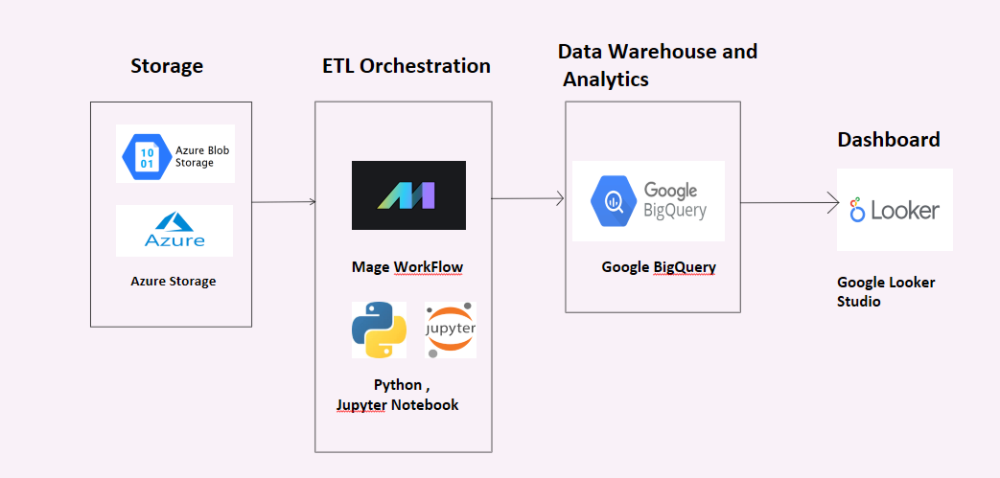

# Uber-Data-Engineering-Project-ETL
Uber-Data-Engineering-Project-ETL
## Introduction 
The goal of this project is to perform data analytics on Uber data using various tools and technologies, including Azure Storage, Python, Compute Instance, Mage Data Pipeline Tool, BigQuery, and Looker Studio.
## Architecture 

## Technology Used
Programming Language - Python
## Platforms
1. Azure Blog Storage
2. Compute Instance 
3. BigQuery
4. Looker Studio

## Data Model

